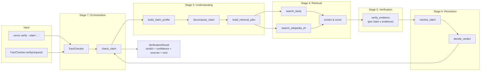

# CERNO

Strict retrieval-augmented fact verification engine.

An independent, generic Python library for verifying factual claims against
external evidence. Not coupled to any business code.

**Design principle:** Never trust a single model. Never confirm a claim without
external evidence.

---

## Architecture



**7-stage pipeline:**
1. **Types** (`cerno/types.py`) — Data models
2. **Consensus** (`cerno/consensus.py`) — Multi-model voting with `StrictestStrategy`
3. **Understanding** (`cerno/understanding.py`) — Claim profiling + atomic decomposition
4. **Retrieval** (`cerno/retrieval.py`) — Tavily + Wikipedia (zh), T0–T3 source tiers
5. **Verification** (`cerno/verification.py`) — Per-evidence model judgement
6. **Resolution** (`cerno/resolver.py`) — Verdict picking with confidence caps
7. **Orchestration** (`cerno/fact_checker.py`) — Pipeline wiring + cost tracking

---

## Requirements

| Requirement | Version | Notes |
|---|---|---|
| Python | >= 3.10 | type-hint heavy, uses `\|` union syntax |
| pip | any | for installing deps |
| Git | any | for editable install |

**External API keys required for live usage:**

| Provider | Required? | Key Name | Get it from |
|---|---|---|---|
| **Qwen** | **Yes (at least one)** | `QWEN_API_KEY` | [DashScope](https://dashscope.console.aliyun.com/) |
| **DeepSeek** | Optional | `DEEPSEEK_API_KEY` | [DeepSeek](https://platform.deepseek.com/) |
| **Xiaomi MiMo** | Optional | `XIAOMI_API_KEY` | MiMo console |
| **Tavily** | Optional | `TAVILY_API_KEY` | [Tavily](https://tavily.com/) (improves recall; without it falls back to Wikipedia) |

**No API key = offline mode only.** The 309 unit tests run entirely offline.

---

## Install

```bash
# 1. Clone
git clone https://github.com/zaoshuidy/AI-CERNO.git
cd AI-CERNO

# 2. Install in editable mode
pip install -e ".[dev]"

# 3. Configure API keys
cp .env.example .env
# Edit .env and fill in your keys
```

---

## Quick start

```python
from cerno import FactChecker, VerificationRequest, LLMProvider

checker = FactChecker(
    llm_providers=[
        LLMProvider(
            name="qwen",
            api_key="your-key",
            base_url="https://dashscope.aliyuncs.com/compatible-mode/v1",
            model="qwen-turbo",
        ),
    ],
    tavily_api_key="your-tavily-key",  # optional; without it Wikipedia is used
)

result = checker.verify(VerificationRequest(claim="爱因斯坦获得诺贝尔物理学奖"))
print(result.verdict)       # "likely_correct" | "likely_error" | ...
print(result.confidence)    # 0.0 - 1.0
print(result.reasoning)     # human-readable summary
print(result.cost.llm_calls)    # number of LLM calls made
print(result.cost.input_tokens) # total input tokens consumed
```

---

## CLI

```bash
# Single claim
cerno verify --claim "爱因斯坦获得诺贝尔物理学奖" --provider qwen --json

# Batch
cerno verify-batch claims.json --provider qwen --json

# Multiple providers for consensus
cerno verify --claim "..." --provider qwen deepseek --json

# Pin a specific model version
cerno verify --claim "..." --provider qwen --model qwen-plus --json
```

API keys are read from environment variables only — never from CLI arguments.

---

## Environment variables

Copy `.env.example` to `.env` and fill in the keys you need.

| Variable | Required | Default | Purpose |
|---|---|---|---|
| `TAVILY_API_KEY` | No | — | Web search via Tavily |
| `QWEN_API_KEY` | No | — | Qwen LLM provider |
| `QWEN_BASE_URL` | No | `https://dashscope.aliyuncs.com/compatible-mode/v1` | Qwen endpoint |
| `QWEN_MODEL` | No | `qwen-turbo` | Qwen model name |
| `XIAOMI_API_KEY` | No | — | Xiaomi MiMo provider |
| `DEEPSEEK_API_KEY` | No | — | DeepSeek provider |
| `CERNO_PRIMARY_PROVIDER` | No | `qwen` | Default provider when using `build_provider_from_env` |
| `CERNO_CONSENSUS_MODE` | No | `single` | `single` or `consensus` (multi-model) |

At least one LLM provider key must be configured for the engine to start.

---

## Multi-provider consensus

Pass multiple providers to run consensus across models:

```python
from cerno import FactChecker
from cerno.cli import build_provider_from_env

checker = FactChecker(
    llm_providers=[
        build_provider_from_env("qwen"),
        build_provider_from_env("deepseek"),
    ],
)
```

Or via CLI:

```bash
cerno verify --claim "..." --provider qwen deepseek --json
```

**Consensus strategy:** `StrictestStrategy` — 14-row merge table. If any model
refutes, the net relation is refutes. Temperature hardcoded to `0.0` for
reproducibility.

---

## Verdicts

| Verdict | Meaning |
|---|---|
| `likely_correct` | Evidence strongly supports the claim |
| `likely_error` | Evidence contradicts the claim |
| `needs_review` | Evidence is weak or ambiguous |
| `unverifiable` | Not a checkable claim, or no evidence found |
| `conflicting_sources` | Supporting and refuting evidence both exist |

---

## Cost tracking

Every `VerificationResult` carries a `CostBreakdown`:

```python
result.cost.input_tokens    # total prompt tokens
result.cost.output_tokens   # total completion tokens
result.cost.llm_calls       # number of LLM API calls
result.cost.retrieval_calls # number of search/retrieval calls
result.cost.cache_hits      # retrieval cache hits
```

---

## Tests

**Offline unit tests** (no network, no API keys):

```bash
pytest -q
# 309 passed, 2 skipped
```

**Live smoke tests** (hit real APIs, require keys):

```bash
# Quick connectivity check
python scripts/test_connectivity.py

# Full live test suite
LIVE_TEST=1 pytest -q -m live
```

---

## Provider quality notes

See [docs/PROVIDERS.md](docs/PROVIDERS.md) for detailed provider recommendations.

- **Qwen** (`qwen-turbo` and up): Currently recommended as the default
  high-risk fact-checking model. Good at catching factual errors.
- **DeepSeek-V4-Flash**: Available as a candidate provider. In our tests it
  showed weaker recall on historical-fact errors; use as a secondary/
  consensus model rather than the sole verifier for high-stakes claims.

---

## Agent usage (Claude / Hermes)

See [docs/AGENT_USAGE.md](docs/AGENT_USAGE.md) for instructions on calling
cerno from AI agents.

---

## Integration: Three-Review System

See [docs/CERNO_三审三校集成提示词.md](docs/CERNO_三审三校集成提示词.md) for
integrating CERNO into a traditional publishing "three-review three-proofread"
workflow.

---

## Architecture docs

- [docs/ARCHITECTURE.md](docs/ARCHITECTURE.md) — Full architecture documentation
- [docs/PROVIDERS.md](docs/PROVIDERS.md) — Provider configuration guide
- [docs/AGENT_USAGE.md](docs/AGENT_USAGE.md) — Agent calling conventions

---

## Disclaimer

This library performs **assistive** fact verification using external LLMs and
search APIs. It does **not** guarantee 100% accuracy. Output should be reviewed
by a human before being used for legal, medical, or other high-stakes
decisions.

---

## License

MIT — see [LICENSE](LICENSE).
