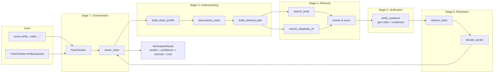
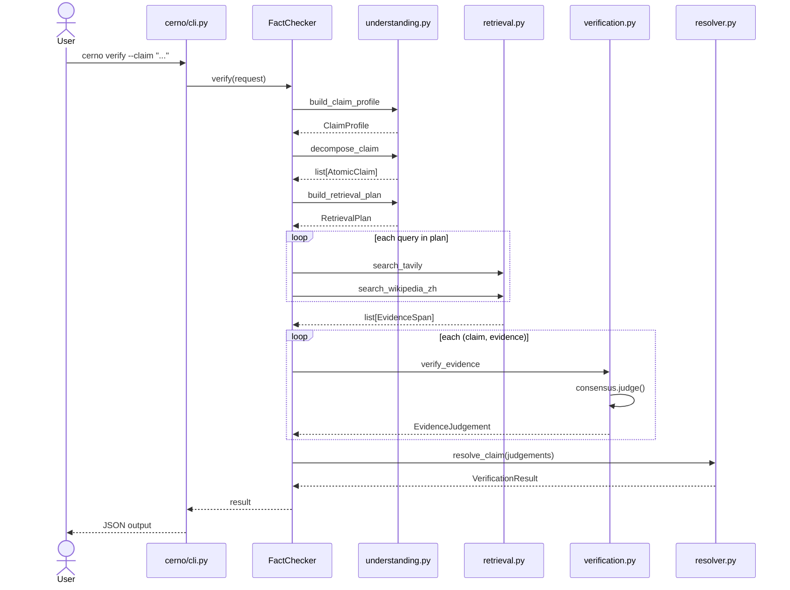

# CERNO Architecture

## Overview

CERNO is a strict retrieval-augmented fact verification engine. It verifies a
factual claim in seven stages, never trusting a single model and never
confirming a claim without external evidence.

## Pipeline (7 Stages)

## Module Map

| File | Stage | Responsibility |
|---|---|---|
| `cerno/types.py` | 1 | Dataclasses: `VerificationRequest`, `VerificationResult`, `EvidenceSpan`, `AtomicClaim`, etc. |
| `cerno/consensus.py` | 2 | `MultiModelConsensus` — queries N LLMs in parallel, merges votes via `StrictestStrategy`. `OpenAICompatibleAdapter` for any OpenAI-compatible endpoint. |
| `cerno/understanding.py` | 3 | LLM-first claim analysis with rule fallback. Produces `ClaimProfile`, list of `AtomicClaim`, and `RetrievalPlan`. |
| `cerno/retrieval.py` | 4 | Tavily + Wikipedia (zh) search, source-tier classification (T0–T3), injection detection, quote extraction, caching. |
| `cerno/verification.py` | 5 | `verify_evidence` — for each `(atomic_claim, evidence)` pair, gathers model votes and produces `EvidenceJudgement`. |
| `cerno/resolver.py` | 6 | `resolve_claim` + `decide_verdict` — strict-priority verdict picker with confidence caps. `apply_failure_matrix` for upstream degradation. |
| `cerno/fact_checker.py` | 7 | `FactChecker` + `check_claim` — orchestrates stages 3→6, handles batching, attaches `CostBreakdown` and `TraceRecorder`. |
| `cerno/observability.py` | — | `CostBreakdown`, `TraceRecorder`, `AuditStep` — cross-cutting cost and audit tracking. |
| `cerno/cli.py` | — | `cerno verify` / `cerno verify-batch` argparse entry point. Reads keys from env only. |

## Data Flow

## Key Design Decisions

### Multi-model consensus, not single-model trust
`MultiModelConsensus.judge()` queries every configured provider in parallel.
`StrictestStrategy` merges votes via a 14-row table: if any model refutes, the
net relation is refutes. Temperature is hardcoded to `0.0` for reproducibility.

### LLM-first with rule fallback
Understanding stage tries an LLM first; if JSON is malformed or fields are
missing, it degrades to regex/heuristic fallback. Same pattern in verification.

### Source tier system
| Tier | Meaning | Examples |
|---|---|---|
| T0 | Authoritative primary | `.gov`, `.gov.cn`, `.edu` |
| T1 | High-trust secondary | Wikipedia (zh) |
| T2 | Mainstream media | Reuters, AP, BBC, etc. |
| T3 | Everything else | Blogs, forums, content farms |
| BLOCKED | Injection / content farm | Discarded entirely |

### Confidence caps, not averaging
`resolver.py` caps confidence by taking the MIN of every applicable rule. A
single T0 source caps at 0.75; injection risk caps at 0.40. Caps compose
conservatively.

### Cost tracking everywhere
Every stage that calls an LLM receives an optional `CostBreakdown` and calls
`add_llm()`. Retrieval calls `add_retrieval()`. The final `VerificationResult`
includes the full cost audit.

## Boundary Constraints

- No OpenClawFix adapter imports inside the engine.
- No backend business code imports.
- Live network calls stay behind injectable callables (unit tests run offline).
- API keys read from environment only — never CLI arguments, never hardcoded.
